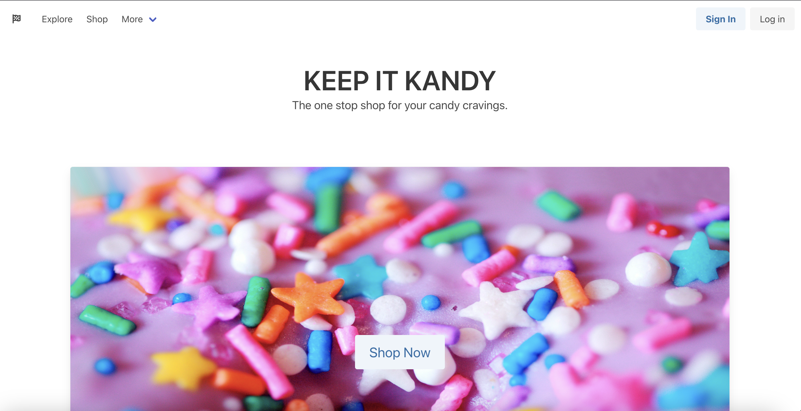

  # Keep-It-Kandy 
  

  ## Description
  The purpose of this project is to create a full-stack web application that connects candy enthusiasts with the best candy in town via an online store front. 

  ## Table of Contents
  * [Usage](#usage)
  * [User Story](#user-story)
  * [Technology Stack](#technology-stack)
  * [Contributors](#contributors)
  * [License](#license)
  * [Questions](#questions)

 ## Usage 
 The Keep It Kandy webpage was deployed using Heroku at the following [URL](https://keepitkandy-131b285227bb.herokuapp.com/). 

 See example below of expected outcome:

 

  ## User Story
  As a candy enthusiast, I WANT to purchase the best candy SO THAT I can conveniently satisfy my cravings.

  ## Technology Stack
  * React
  * GraphQL with Node.js & Express.js
  * MongoDB and Mongoose ODM
  
  ## Contributors

  Click name for GitHub:

  [Aliza Sharma](https://github.com/AlizaSharma)

  [Monica Cordova](https://github.com/cordovamonica)

  [Gerardo Perez](https://github.com/Gera1313)

  [Daisy Olivera Diaz](https://github.com/OliveraDiaz)

  [Ricardo Esparza](https://github.com/Gama0194)

  ## License
  MIT License

  Copyright (c) 2023 cordovamonica, alizasharma

  Permission is hereby granted, free of charge, to any person obtaining a copy
  of this software and associated documentation files (the "Software"), to deal
  in the Software without restriction, including without limitation the rights
  to use, copy, modify, merge, publish, distribute, sublicense, and/or sell
  copies of the Software, and to permit persons to whom the Software is
  furnished to do so, subject to the following conditions:
  The above copyright notice and this permission notice shall be included in all
  copies or substantial portions of the Software.

  THE SOFTWARE IS PROVIDED "AS IS", WITHOUT WARRANTY OF ANY KIND, EXPRESS OR
  IMPLIED, INCLUDING BUT NOT LIMITED TO THE WARRANTIES OF MERCHANTABILITY,
  FITNESS FOR A PARTICULAR PURPOSE AND NONINFRINGEMENT. IN NO EVENT SHALL THE
  AUTHORS OR COPYRIGHT HOLDERS BE LIABLE FOR ANY CLAIM, DAMAGES OR OTHER
  LIABILITY, WHETHER IN AN ACTION OF CONTRACT, TORT OR OTHERWISE, ARISING FROM,
  OUT OF OR IN CONNECTION WITH THE SOFTWARE OR THE USE OR OTHER DEALINGS IN THE
  SOFTWARE.

  ## Questions
  If questions arise on the project, please contact the Group 2 team members (Aliza, Monica, Gerardo, Daisy, Ricardo).
  

